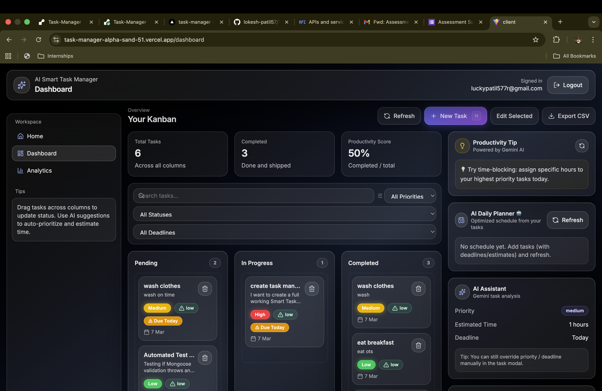

# AI Smart Task Manager

AI-powered task management web app with Kanban board, analytics, and productivity insights. Built with React + Vite on the frontend and Node.js + Express + MongoDB on the backend, with Google OAuth and Gemini-powered AI helpers.

<div class="flex justify-center">
  <br />
      
  <br />
 </div>

## Features

- **Authentication**
  - Email/password registration and login with JWT
  - Google OAuth sign-in with redirect back to the SPA
  - Protected routes for authenticated pages

- **Task management**
  - CRUD for tasks (create, update, delete)
  - Kanban board with drag-and-drop (Pending / In Progress / Completed)
  - Task attributes: title, description, status, priority, deadline, estimated time
  - Selected-task details panel with risk level and AI tips

- **AI-powered productivity**
  - AI daily planner (`AI Daily Planner 🤖`) that generates an optimized schedule from your tasks
  - AI suggestions panel with priority, estimated time, and deadline hints
  - AI task breakdown modal that generates subtasks from a task title

- **Analytics & insights**
  - Productivity score based on completed vs total tasks
  - Weekly completion trends
  - Priority distribution (High/Medium/Low)
  - Task status breakdown charts

- **UX & feedback**
  - Framer Motion page and component transitions
  - Toast notifications for successes and errors (react-toastify)
  - Loading buttons with spinners for async actions
  - Skeleton loaders for dashboard and analytics while data is loading
  - Empty state for new users with CTA and guidance toast

## Tech stack

- **Frontend**
  - React + Vite
  - React Router
  - TailwindCSS
  - Framer Motion
  - Axios
  - React Beautiful DnD
  - Recharts
  - React Toastify

- **Backend**
  - Node.js + Express
  - MongoDB + Mongoose
  - JWT authentication
  - Google OAuth 2.0 (passport-google-oauth20)
  - Gemini API (`@google/generative-ai`)
  - Express-validator, bcryptjs, cors, dotenv

## Project structure

```text
.
├─ client/          # React + Vite SPA
│  ├─ src/
│  │  ├─ pages/         # Login, Register, Home, Dashboard, Analytics, OAuthSuccess
│  │  ├─ components/    # AppShell, Navbar, Sidebar, TaskBoard, TaskModal, AI panels, etc.
│  │  ├─ api/           # Axios instance
│  │  ├─ context/       # AuthContext
│  │  └─ utils/         # Toast utilities
│  └─ package.json
├─ server/          # Node/Express API
│  ├─ controllers/  # Auth, tasks, AI
│  ├─ middleware/   # Auth, error handling
│  ├─ models/       # Mongoose models
│  ├─ routes/       # /auth, /tasks, /ai
│  ├─ config/       # Passport configuration
│  ├─ server.js     # App entrypoint
│  ├─ .env          # Backend environment variables (not for commit)
│  └─ package.json
└─ README.md
```

## Getting started

### Prerequisites

- Node.js (v18+ recommended)
- npm
- MongoDB connection string
- Google OAuth credentials (Client ID, Secret, callback URL)
- Gemini API key

---

### 1. Backend (server)

From the project root:

```bash
cd server
npm install
```

Create a `.env` file in `server/` (do **not** commit real secrets) based on:

```bash
PORT=5001
NODE_ENV=development

MONGO_URI=<your MongoDB connection string>
JWT_SECRET=<long random secret>
JWT_EXPIRES_IN=7d

CLIENT_URL=http://localhost:5173

GOOGLE_CLIENT_ID=<your Google OAuth client id>
GOOGLE_CLIENT_SECRET=<your Google OAuth client secret>
GOOGLE_CALLBACK_URL=http://localhost:5001/api/auth/google/callback

GEMINI_API_KEY=<your Gemini API key>
```

Run the API:

```bash
npm run dev
```

The API will be available on `http://localhost:5001` (or `PORT`).

---

### 2. Frontend (client)

In another terminal from the project root:

```bash
cd client
npm install
```

Create `client/.env` for frontend environment variables:

```bash
VITE_API_URL=http://localhost:5001
```

Start the Vite dev server:

```bash
npm run dev
```

The app will be available on `http://localhost:5173`.

---

### 3. Production build

Build the frontend:

```bash
cd client
npm run build
```

You can then serve the built assets from your preferred static host (or configure the backend to serve them).

## Available scripts

### Client (`client/package.json`)

- `npm run dev` – start Vite dev server
- `npm run build` – build for production
- `npm run preview` – preview the production build
- `npm run lint` – run ESLint

### Server (`server/package.json`)

- `npm run dev` – start the Express server in dev mode
- `npm start` – start the Express server

## License

This project is licensed under the **MIT License**. See `LICENSE` for details.

